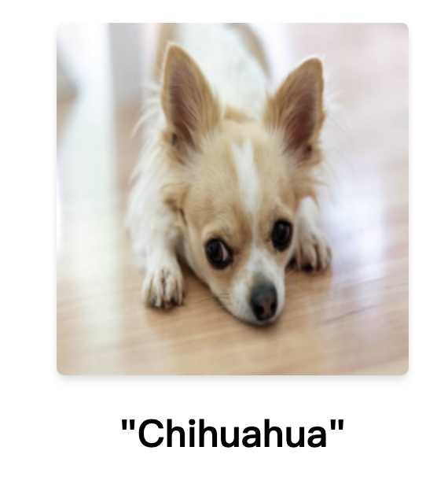
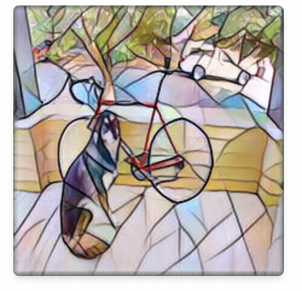
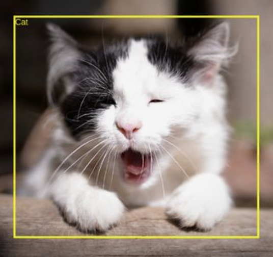

<h1 align="center">sznn</h1>
<p align="center">🚀 High performance nerual network framework running on Web.</p>

# Overview

<table>
  <tr>
    <td align="center">
      
    </td>
    <td align="center">
      
    </td>
    <td align="center">
      
    </td>
  </tr>
  <tr>
    <td align="center">
      <a href="./examples/classify/">Classification</a>
    </td>
    <td align="center">
      <a href="./examples/transfer/">Style Transfer</a>
    </td>
    <td align="center">
      <a href=".">Object Detection(TBD)</a>
    </td>
  </tr>
</table>


# Usage

Firstly you should determine which backend to use. sznn provides 3 backends(JS, WebAssembly and WebGPU). But currently you could only choose best backend statically by yourself.

Fortunately, we provide a tool as suggestion. Just directly open `tools/schedule/detect.html` in your target browser and you will see our recommendation.

Two simple API then you can inference ONNX models:

```js
  const model = await loadModel("./model.onnx");
  const output = await model.forward(input);
```


# Benchmark

Here is SqueezeNet inference benchmark. Test on my M1 MacBook Pro, Chome Canary v100.


Obviously, sznn has a long way to go. 😅


# Roadmap

⚠️ **Note**: This project is still heavily in development. Please **DO NOT** use it in production environment! ⚠️

Let's make sznn better together.


# License

[Apache-2.0 License](LICENSE)

Copyright ©️ 2022 Sh-Zh-7
