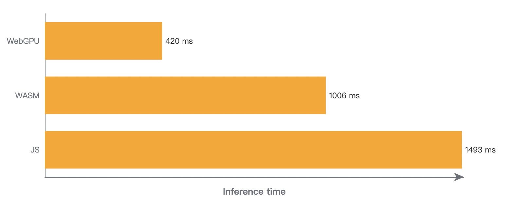

<h1 align="center">sznn</h1>
<p align="center">🚀 High performance nerual network framework running on Web.</p>

<p align="center">
    <a href="https://github.com/ShZh-libraries/sznn/issues" style="text-decoration:none" >
        
    </a>
    <a href="https://github.com/ShZh-libraries/sznn" style="text-decoration:none" >
        
    </a>
  <a href="https://github.com/ShZh-libraries/sznn" style="text-decoration:none">
        
    </a>
</p>

# Overview

<table>
  <tr>
    <td align="center">
      
    </td>
    <td align="center">
      
    </td>
    <td align="center">
      
    </td>
  </tr>
  <tr>
    <td align="center">
      <a href="./examples/classify/">Classification</a>
    </td>
    <td align="center">
      <a href="./examples/transfer/">Style Transfer</a>
    </td>
    <td align="center">
      <a href="./examples/detect/">Object Detection(TBD)</a>
    </td>
  </tr>
</table>

# Usage

Firstly you should determine which backend to use. sznn provides 3 backends(JS, WASM and WebGPU). But currently you could only choose best backend statically by yourself.

Fortunately, we provide a tool as suggestion. Just directly open `tools/schedule/detect.html` in your target browser and you will see our recommendation.

Two simple API then you can inference ONNX models:

```js
const model = await loadModel("./model.onnx");
const output = await model.forward(input);
```

# Benchmark

Here is SqueezeNet inference benchmark. Test on my M1 MacBook Pro, Chome Canary v100.



Obviously, sznn has a long way to go. 😅

# Roadmap

> **Warning**
>
> This project is still heavily in development. Please **DO NOT** use it in production environment!

- [ ] Enrich more ONNX opreators. ([#1](https://github.com/ShZh-libraries/sznn/issues/1))
- [ ] Add YOLO as detection example. ([#2](https://github.com/ShZh-libraries/sznn/issues/2))
- [ ] Optimize convolutional layer. ([#3](https://github.com/ShZh-libraries/sznn/issues/3))
- [ ] Improve backends performace. ([#4](https://github.com/ShZh-libraries/sznn/issues/4)) ([#5](https://github.com/ShZh-libraries/sznn/issues/5))

Let's make sznn better together.

# License

[Apache-2.0 License](LICENSE)

Copyright ©️ 2022 Sh-Zh-7
